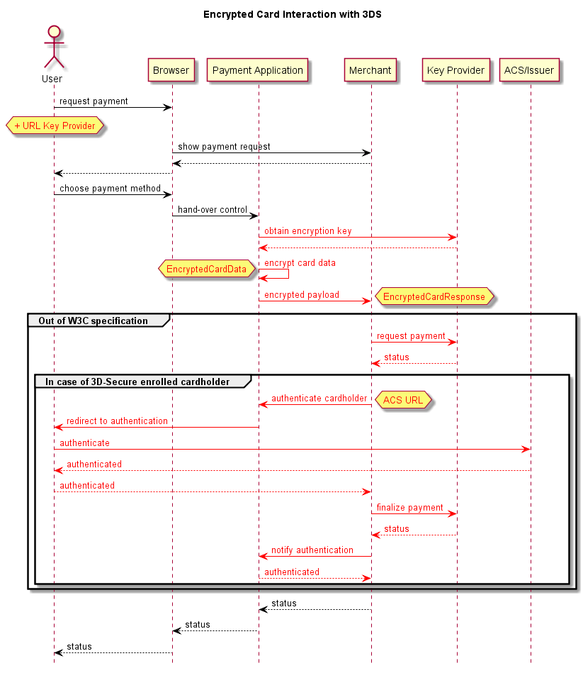

# POC W3C WebPayments

## Introduction

A working example of how Payment Request API may looks like with encrypted card tokenization and 3DS.  
This project is composed by three parts :

* `key-provider` provides a public key to the PR API (card data encryption) and handles payments from the merchant (card data decryption)
* `payment-request-polyfill` implements the standard [Payment Request API](https://w3c.github.io/payment-request/) and adds the support of encrypted card tokenization + 3DS
* `demo-store` only uses the standard Payment Request API



## Demo

An online demo is available at <https://demostore-webpaymentapi-demo.lyra-labs.fr>.  

## Installation

### Prerequisites

If you don't already use [Yarn](https://yarnpkg.com), you can install it with `npm install -g yarn`.  
But you can also keep using `npm`, just replace all `yarn` by `npm` in the following instructions.

### Key Provider

The Key Provider is a simple nodejs server who acts like a "proxy" between the merchant and its payment backend.  
By default, it runs at `http://localhost:9092`

```
cd key-provider
yarn install
yarn start
```

See [Key Provider](https://github.com/lyra-labs/poc-w3c-webpayments/tree/master/key-provider) for more details.

### Demo Store

This demo store uses the standard [Payment Request API](https://w3c.github.io/payment-request/), which is polyfilled by us to handle encrypted card tokenization and 3DS.
By default, it runs at `http://localhost:9093`

```
# In a different shell
cd payment-request-polyfill
yarn install
yarn build
yarn link
cd ../demo-store
yarn install
yarn link payment-request-polyfill
yarn start
```

See [Demo Store](https://github.com/lyra-labs/poc-w3c-webpayments/tree/master/demo-store) for more details.

Now, just browse [http://localhost:9093](http://localhost:9093) and try to buy something.  
All payment calls are binded to our a demo [PayZen](https://payzen.eu/) payment server, nothing will be debited, the payment is only simulated.  
If you want a completely offline mode, you can start the `key-provider` with the parameter `--backend` set to `mock`: `yarn start --backend mock`  
By default, a bunch of testing cards are registered in our Payment Request API polyfill, you can use them.

## Contact

Gildas Le Louarn <gildas.lelouarn@lyra-network.com>  
Alexandre Fournier <alexandre.fournier@lyra-network.com>
